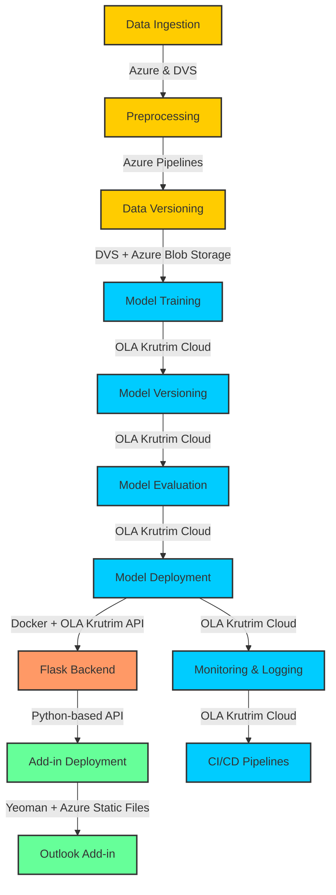

# Auto-Processing-of-Emails

In today's fast-paced business environment, professionals often receive an overwhelming number of emails daily. Managing these emails efficiently is critical for ensuring timely responses, prioritizing important tasks, and maintaining effective communication. However, manually sorting, categorizing, and summarizing emails can be time-consuming and prone to errors. Leveraging Natural Language Processing (NLP) and machine learning techniques to automate these tasks can significantly enhance productivity and reduce the cognitive load on individuals. This project aims to develop an intelligent email processing system that categorizes, summarizes, and prioritizes emails, enabling users to focus on what truly matters.

# Workflow

